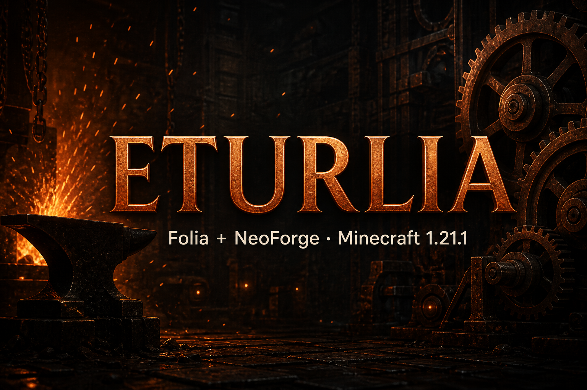

<div align="center">
    
    <h1>Eturlia</h1>
    <p>Folia (регионы) + NeoForge — ядро сервера Minecraft <strong>1.21.1</strong></p>
    <p>
      <a href="#русский">Русский</a> ·
      <a href="#english">English</a>
    </p>
</div>

---

# Русский

## Ребренд Crelia → Eturlia

**Crelia переименована в Eturlia.** Это тот же гибридный проект (Folia + NeoForge), новая торговая марка и имена во всём ядре.

| Было (Crelia) | Стало (Eturlia) |
|---------------|-----------------|
| пакеты `crelia.*` / `com.crelia.*` | `eturlia.*` / `com.eturlia.*` |
| `crelia-1.21.1-neoforge-….jar` | **`eturlia-1.21.1-neoforge-21.1.248.jar`** |
| launch target `creliaserver` | **`eturliaserver`** |
| `CreliaServer`, `CreliaGameLocator`, … | `EturliaServer`, `EturliaGameLocator`, … |
| `crelia-compat-create` / `sable` | `eturlia-compat-create` / `eturlia-compat-sable` |

Релиз с ребрендом: **[v0.2.0](https://github.com/eturnercus/Core/releases/tag/v0.2.0)**  
Картинка выше: старое имя зачёркнуто, новое — **Eturlia**.

> [!WARNING]
> Экспериментальный проект. **Не для продакшена.** Многие моды несовместимы с региональной многопоточностью Folia.

## Что это

Eturlia собирает **один fat-jar ядра**, в котором:

- **[Folia](https://github.com/PaperMC/Folia)** — форк Paper с тиками по регионам
- **[NeoForge](https://github.com/neoforged/NeoForge) 21.1.248** — загрузка модов (FancyModLoader 4.0.43)

Цель: гонять Create / tech-паки на многоядерной модели Folia.

## Версии

| Компонент | Версия |
|-----------|--------|
| Minecraft | 1.21.1 |
| NeoForge | **21.1.248** |
| FML (FancyModLoader) | 4.0.43 |
| Paper upstream | `84281ceeefb9d294758a9a292ba6c01da40e8409` (Folia `dev/1.21.1`) |
| Java | 21 |

## Сборка

Нужны **git clone** (не ZIP), **JDK 21**, сеть до PaperMC и NeoForged Maven.

```bash
# 1) Накатить патчи Folia + Eturlia/NeoForge на Paper
./gradlew applyPatches

# 2) Собрать Folia-Server
./gradlew :folia-server:build

# 3) Собрать standalone jar ядра
./gradlew :folia-server:eturliaStandaloneJar
```

Результат:

```text
build/libs/eturlia-1.21.1-neoforge-21.1.248.jar
```

Шорткаты: `./patch.sh` (applyPatches), `./rb.sh` (rebuild patches).

## Запуск

```bash
java -jar build/libs/eturlia-1.21.1-neoforge-21.1.248.jar --nogui
```

Лаунчер распакует библиотеки и стартует `eturlia.EturliaServer` с FML.  
При первом запуске примите `eula.txt`. Моды NeoForge — в `mods/`. Плагины — только с `folia-supported: true`.

**Не кладите `spark-neoforge` в `mods/`** — spark уже вшит в Folia (JPMS conflict).

## Архитектура (кратко)

1. **paperweight 1.7.3** накатывает `patches/api` + `patches/server`.
2. **Шимы** в `build-data/eturlia-neoforge-shims` — компиляция NMS против stub NeoForge API.
3. В runtime вложен **NeoForge universal 21.1.248**.
4. **Coremods** — SPI `ICoreMod` (NeoForge 21.1).
5. Fat jar: Folia + FML + NeoForge + runtime Eturlia.

## Апстрим

- [PaperMC/Folia](https://github.com/PaperMC/Folia) (`dev/1.21.1`)
- [PaperMC/Paper](https://github.com/PaperMC/Paper)
- [NeoForged/NeoForge](https://github.com/neoforged/NeoForge) (`1.21.1` / 21.1.x)

## Лицензия

У разных деревьев разные лицензии. Патчи Folia/Paper: [`PATCHES-LICENSE`](./PATCHES-LICENSE). NeoForge — LGPL / заголовки файлов апстрима.

## Статус патчей

Активные server-патчи: Folia `0001`–`0019` + NeoForge/Eturlia `0020`–`0030`.  
WIP-пакеты `0033`–`0040` лежат в `patches/server-wip/` и пока чисто не накатываются.

---

<details>
<summary><strong>English</strong> — click to expand</summary>

<div id="english"></div>

# English

## Rebrand: Crelia → Eturlia

**Crelia has been renamed to Eturlia.** Same Folia + NeoForge hybrid; new brand and identifiers across the core.

| Was (Crelia) | Now (Eturlia) |
|--------------|---------------|
| packages `crelia.*` / `com.crelia.*` | `eturlia.*` / `com.eturlia.*` |
| `crelia-1.21.1-neoforge-….jar` | **`eturlia-1.21.1-neoforge-21.1.248.jar`** |
| launch target `creliaserver` | **`eturliaserver`** |
| `CreliaServer`, `CreliaGameLocator`, … | `EturliaServer`, `EturliaGameLocator`, … |
| `crelia-compat-create` / `sable` | `eturlia-compat-create` / `eturlia-compat-sable` |

Rebrand release: **[v0.2.0](https://github.com/eturnercus/Core/releases/tag/v0.2.0)**  
Hero image above: old name struck through, new name **Eturlia**.

> [!WARNING]
> Experimental. **Not production-ready.** Many mods break under Folia region threading.

## What this is

Eturlia builds a **single server core jar** that combines:

- **[Folia](https://github.com/PaperMC/Folia)** — Paper fork with per-region multi-threading
- **[NeoForge](https://github.com/neoforged/NeoForge) 21.1.248** — mod loading (FancyModLoader 4.0.43)

Goal: run Create / tech-mod packs on Folia’s multi-core region model.

## Versions

| Component | Version |
|-----------|---------|
| Minecraft | 1.21.1 |
| NeoForge | **21.1.248** |
| FML (FancyModLoader) | 4.0.43 |
| Paper upstream | `84281ceeefb9d294758a9a292ba6c01da40e8409` (Folia `dev/1.21.1`) |
| Java | 21 |

## Build

Requires a **Git clone** (not a ZIP), **JDK 21**, and network access to PaperMC + NeoForged Maven.

```bash
./gradlew applyPatches
./gradlew :folia-server:build
./gradlew :folia-server:eturliaStandaloneJar
```

Output: `build/libs/eturlia-1.21.1-neoforge-21.1.248.jar`

## Run

```bash
java -jar build/libs/eturlia-1.21.1-neoforge-21.1.248.jar --nogui
```

Accept `eula.txt` on first run. NeoForge mods go in `mods/`. Plugins still need `folia-supported: true`.  
**Do not** put `spark-neoforge` in `mods/` — spark is already bundled (JPMS split).

## Architecture (short)

1. **paperweight 1.7.3** applies `patches/api` + `patches/server`.
2. **Shims** under `build-data/eturlia-neoforge-shims` for NeoForge API stubs at compile time.
3. **Published NeoForge universal** `21.1.248` is embedded at runtime.
4. **Coremods** use NeoForge 21.1 `ICoreMod` SPI.
5. **Eturlia launcher** ships Folia + FML + NeoForge + Eturlia runtime in one jar.

## Upstream

- [PaperMC/Folia](https://github.com/PaperMC/Folia) (`dev/1.21.1`)
- [PaperMC/Paper](https://github.com/PaperMC/Paper)
- [NeoForged/NeoForge](https://github.com/neoforged/NeoForge) (`1.21.1` / 21.1.x)

## License

Different trees use different licenses. Folia/Paper patches: [`PATCHES-LICENSE`](./PATCHES-LICENSE). NeoForge: upstream LGPL / file headers.

## Patch status

Active server patches: Folia `0001`–`0019` + NeoForge/Eturlia `0020`–`0030`.  
WIP batches `0033`–`0040` live under `patches/server-wip/` and do not apply cleanly yet.

</details>
